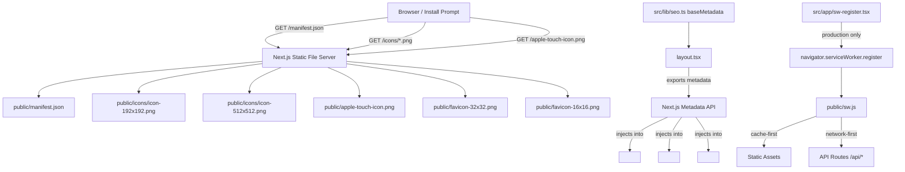

# Design Document: PWA Manifest & Icons

## Overview

This design adds Progressive Web App (PWA) support to the FluxaPay merchant dashboard. The implementation is intentionally minimal and non-breaking: a static `manifest.json` in `/public`, a set of PNG icon assets derived from the existing SVG logo, and updates to the Next.js Metadata API in `src/lib/seo.ts` and `src/app/layout.tsx`.

The optional Lighthouse compliance path (Requirement 5) adds a production-only service worker using the browser's native Service Worker API — no `next-pwa` or Workbox dependency is introduced, keeping the bundle clean.

### Key Design Decisions

- **Static manifest over `app/manifest.ts`**: Next.js supports both a static `public/manifest.json` and a dynamic `app/manifest.ts` route. A static file is simpler, has no runtime cost, and is sufficient for this feature's requirements.
- **No new PWA library**: `next-pwa` and Workbox add significant complexity and bundle weight. A hand-written service worker covering the two required strategies (cache-first for static assets, network-first for API routes) is small and fully auditable.
- **Icon generation via script**: PNG icons are generated from `logo.svg` using a Node.js build script (Sharp), not committed as binary blobs. This keeps the source of truth in the SVG and makes regeneration trivial.
- **`baseMetadata` as the single source of truth**: All PWA-related metadata (manifest link, icons, theme color) is added to `baseMetadata` in `seo.ts` so every page inherits it automatically.

---

## Architecture



The architecture has three independent layers:

1. **Static assets** — `manifest.json` and PNG icons served directly by Next.js from `/public`. No runtime code involved.
2. **Metadata injection** — `baseMetadata` in `seo.ts` declares the manifest link, icons, and theme color. Next.js renders these into `<head>` tags at build time (static) or request time (dynamic routes).
3. **Service worker** (optional, Requirement 5) — a hand-written `public/sw.js` registered by a client component only in production.

---

## Components and Interfaces

### 1. `public/manifest.json`

Static JSON file. No TypeScript interface needed — it is consumed directly by browsers.

```json
{
  "name": "FluxaPay",
  "short_name": "FluxaPay",
  "description": "The FluxaPay merchant dashboard — manage payments, invoices, and settlements.",
  "start_url": "/",
  "display": "standalone",
  "orientation": "portrait-primary",
  "theme_color": "#FED449",
  "background_color": "#2E3539",
  "icons": [
    {
      "src": "/icons/icon-192x192.png",
      "sizes": "192x192",
      "type": "image/png",
      "purpose": "any maskable"
    },
    {
      "src": "/icons/icon-512x512.png",
      "sizes": "512x512",
      "type": "image/png",
      "purpose": "any maskable"
    }
  ]
}
```

### 2. Icon Assets

Generated by `scripts/generate-pwa-icons.ts` using [Sharp](https://sharp.pixelplumbing.com/). Sharp is added as a `devDependency`.

| File | Size | Purpose |
|------|------|---------|
| `public/icons/icon-192x192.png` | 192×192 | Manifest icon (Android home screen) |
| `public/icons/icon-512x512.png` | 512×512 | Manifest icon (splash screen, high-DPI) |
| `public/apple-touch-icon.png` | 180×180 | iOS home screen icon |
| `public/favicon-32x32.png` | 32×32 | Browser tab favicon |
| `public/favicon-16x16.png` | 16×16 | Browser tab favicon (legacy) |

The script reads `public/assets/logo.svg`, rasterises it at each target size with a `#2E3539` background fill (so the icon looks correct on both light and dark OS themes), and writes the PNGs.

### 3. `src/lib/seo.ts` — `baseMetadata` additions

The `baseMetadata` object gains three new fields:

```typescript
export const baseMetadata: Metadata = {
  // ... existing fields ...
  manifest: "/manifest.json",
  icons: {
    apple: "/apple-touch-icon.png",
    icon: [
      { url: "/favicon-32x32.png", sizes: "32x32", type: "image/png" },
      { url: "/favicon-16x16.png", sizes: "16x16", type: "image/png" },
    ],
  },
  themeColor: [
    { media: "(prefers-color-scheme: light)", color: "#FED449" },
    { media: "(prefers-color-scheme: dark)",  color: "#2E3539" },
  ],
};
```

### 4. `src/app/layout.tsx`

No structural changes required. The `metadata` export already spreads `baseMetadata`, so the new fields are inherited automatically:

```typescript
export const metadata: Metadata = {
  ...baseMetadata,
};
```

### 5. `src/app/sw-register.tsx` (optional — Requirement 5)

A `"use client"` component that registers the service worker only in production:

```typescript
"use client";
import { useEffect } from "react";

export function ServiceWorkerRegistration() {
  useEffect(() => {
    if (
      process.env.NODE_ENV === "production" &&
      "serviceWorker" in navigator
    ) {
      navigator.serviceWorker
        .register("/sw.js")
        .catch((err) => console.error("SW registration failed:", err));
    }
  }, []);
  return null;
}
```

This component is added to `RootLayout`'s `<body>` alongside `<Providers>`.

### 6. `public/sw.js` (optional — Requirement 5)

A hand-written service worker implementing two routing strategies:

- **Cache-first** for static assets: JS, CSS, fonts, images, and the manifest itself.
- **Network-first** for API routes (`/api/*`): always tries the network; falls back to cache on failure.

```javascript
const CACHE_NAME = "fluxapay-v1";
const STATIC_EXTENSIONS = /\.(js|css|png|jpg|jpeg|svg|woff2?|ttf|ico|webmanifest|json)$/;

self.addEventListener("fetch", (event) => {
  const { request } = event;
  const url = new URL(request.url);

  if (url.pathname.startsWith("/api/")) {
    // Network-first for API routes
    event.respondWith(networkFirst(request));
  } else if (STATIC_EXTENSIONS.test(url.pathname)) {
    // Cache-first for static assets
    event.respondWith(cacheFirst(request));
  }
  // All other requests fall through to the browser default
});

async function cacheFirst(request) {
  const cached = await caches.match(request);
  if (cached) return cached;
  const response = await fetch(request);
  if (response.ok) {
    const cache = await caches.open(CACHE_NAME);
    cache.put(request, response.clone());
  }
  return response;
}

async function networkFirst(request) {
  try {
    const response = await fetch(request);
    if (response.ok) {
      const cache = await caches.open(CACHE_NAME);
      cache.put(request, response.clone());
    }
    return response;
  } catch {
    return caches.match(request);
  }
}
```

### 7. `scripts/generate-pwa-icons.ts`

Build-time script. Run once (or in CI) to produce the PNG assets:

```typescript
import sharp from "sharp";
import path from "path";

const LOGO_SVG = path.resolve("public/assets/logo.svg");
const OUTPUT_DIR = path.resolve("public");
const BACKGROUND = { r: 46, g: 53, b: 57, alpha: 1 }; // #2E3539

const targets = [
  { file: "icons/icon-192x192.png", size: 192 },
  { file: "icons/icon-512x512.png", size: 512 },
  { file: "apple-touch-icon.png",   size: 180 },
  { file: "favicon-32x32.png",      size: 32  },
  { file: "favicon-16x16.png",      size: 16  },
];

for (const { file, size } of targets) {
  await sharp(LOGO_SVG)
    .resize(size, size, { fit: "contain", background: BACKGROUND })
    .flatten({ background: BACKGROUND })
    .png()
    .toFile(path.join(OUTPUT_DIR, file));
  console.log(`Generated ${file}`);
}
```

---

## Data Models

### Manifest Icon Entry

```typescript
interface ManifestIcon {
  src: string;       // URL path to the icon file, e.g. "/icons/icon-192x192.png"
  sizes: string;     // WxH format, e.g. "192x192"
  type: string;      // MIME type, e.g. "image/png"
  purpose?: string;  // "any" | "maskable" | "any maskable"
}
```

### Web App Manifest

```typescript
interface WebAppManifest {
  name: string;
  short_name: string;
  description: string;
  start_url: string;
  display: "standalone" | "fullscreen" | "minimal-ui" | "browser";
  orientation: string;
  theme_color: string;
  background_color: string;
  icons: ManifestIcon[];
}
```

### Service Worker Routing Decision

```typescript
type CachingStrategy = "cache-first" | "network-first" | "passthrough";

function selectStrategy(url: URL): CachingStrategy {
  if (url.pathname.startsWith("/api/")) return "network-first";
  if (STATIC_EXTENSIONS.test(url.pathname)) return "cache-first";
  return "passthrough";
}
```

---

## Correctness Properties

*A property is a characteristic or behavior that should hold true across all valid executions of a system — essentially, a formal statement about what the system should do. Properties serve as the bridge between human-readable specifications and machine-verifiable correctness guarantees.*

This feature is a good candidate for property-based testing in two focused areas: (1) the structural validity of icon entries (which must satisfy a schema regardless of which icons are declared), and (2) the service worker routing logic (a pure function mapping URLs to strategies). The manifest field values and file existence checks are better served by example-based unit tests.

The project already has `fast-check` installed as a dev dependency, so no new library is needed.

### Property 1: Icon entry structural completeness

*For any* icon entry object in the manifest `icons` array, the entry must contain a non-empty `src` string, a non-empty `sizes` string, and a non-empty `type` string.

**Validates: Requirements 1.10**

### Property 2: Service worker environment guard

*For any* string value of `NODE_ENV`, the service worker registration function must call `navigator.serviceWorker.register` if and only if the value equals `"production"`.

**Validates: Requirements 5.6**

### Property 3: Service worker routing strategy selection

*For any* URL string, the `selectStrategy` function must return `"network-first"` when the pathname starts with `/api/`, `"cache-first"` when the pathname matches a static asset extension, and `"passthrough"` otherwise. These three cases are mutually exclusive and exhaustive for any valid URL.

**Validates: Requirements 5.7**

---

## Error Handling

| Scenario | Behavior |
|----------|----------|
| `manifest.json` missing or malformed | Browser silently ignores the broken `<link rel="manifest">` tag; the app continues as a standard web app (Requirement 1.11). No JavaScript error is thrown. |
| Icon file missing (404) | Browser falls back to its default favicon. No app-level error. |
| Service worker registration fails | The `catch` handler logs to `console.error` but does not throw. The app continues without offline support. |
| Service worker `fetch` handler throws | The browser falls through to the default network request. No user-visible error. |
| Sharp icon generation fails in CI | The build script exits with a non-zero code, failing the CI step before the broken assets reach production. |

---

## Testing Strategy

### Unit / Example Tests (`src/__tests__/pwa/`)

These tests verify specific field values and file existence. They run in Vitest with jsdom.

| Test | What it checks |
|------|---------------|
| `manifest.test.ts` | Parses `public/manifest.json` and asserts all required fields match the spec (name, short_name, description, start_url, display, theme_color, background_color, orientation, icons array non-empty) |
| `seo-pwa.test.ts` | Imports `baseMetadata` from `seo.ts` and asserts `manifest`, `icons`, and `themeColor` fields are present with correct values |
| `icon-files.test.ts` | Asserts each expected PNG file exists on disk at the correct path |

### Property-Based Tests (`src/__tests__/pwa/pwa.property.test.ts`)

Uses `fast-check` (already installed). Minimum 100 runs per property.

**Property 1 — Icon entry completeness**
```typescript
// Feature: pwa-manifest-icons, Property 1: icon entry structural completeness
fc.assert(
  fc.property(
    fc.record({
      src:     fc.string({ minLength: 1 }),
      sizes:   fc.string({ minLength: 1 }),
      type:    fc.string({ minLength: 1 }),
      purpose: fc.option(fc.string()),
    }),
    (icon) => {
      expect(isValidManifestIcon(icon)).toBe(true);
    }
  ),
  { numRuns: 100 }
);
```

**Property 2 — Service worker environment guard**
```typescript
// Feature: pwa-manifest-icons, Property 2: service worker environment guard
fc.assert(
  fc.property(
    fc.string(),
    (env) => {
      const registered = simulateSwRegistration(env);
      expect(registered).toBe(env === "production");
    }
  ),
  { numRuns: 100 }
);
```

**Property 3 — Routing strategy selection**
```typescript
// Feature: pwa-manifest-icons, Property 3: service worker routing strategy selection
fc.assert(
  fc.property(
    fc.oneof(
      fc.constant("/api/payments"),
      fc.string().map((s) => `/api/${s}`),
      fc.constant("/icons/icon-192x192.png"),
      fc.string().map((s) => `/${s}.js`),
      fc.string().map((s) => `/${s}.css`),
      fc.string(),
    ),
    (pathname) => {
      const url = new URL(`https://fluxapay.com${pathname.startsWith("/") ? pathname : "/" + pathname}`);
      const strategy = selectStrategy(url);
      if (url.pathname.startsWith("/api/")) {
        expect(strategy).toBe("network-first");
      } else if (STATIC_EXTENSIONS.test(url.pathname)) {
        expect(strategy).toBe("cache-first");
      } else {
        expect(strategy).toBe("passthrough");
      }
    }
  ),
  { numRuns: 200 }
);
```

### Integration / Smoke Tests

- **Lighthouse CI** (optional): Run `lhci autorun` against the production build in CI to verify PWA installability, maskable icon, theme-color meta, and service worker audits.
- **Manual install test**: Install the PWA on Chrome (desktop) and Safari (iOS) and verify the icon, splash screen color, and standalone display mode.

### PBT is NOT appropriate for

- Manifest field values (static JSON — example tests are sufficient)
- File existence checks (filesystem state — example tests are sufficient)
- Next.js metadata rendering into HTML (framework behavior — integration tests)
- Lighthouse audit results (external tool — smoke/CI tests)
